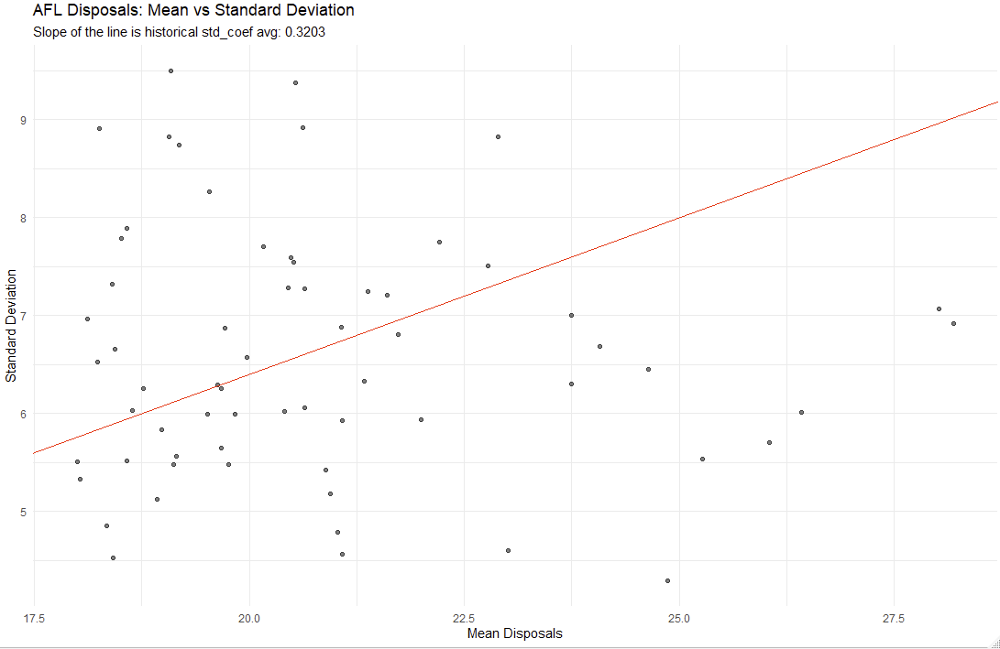
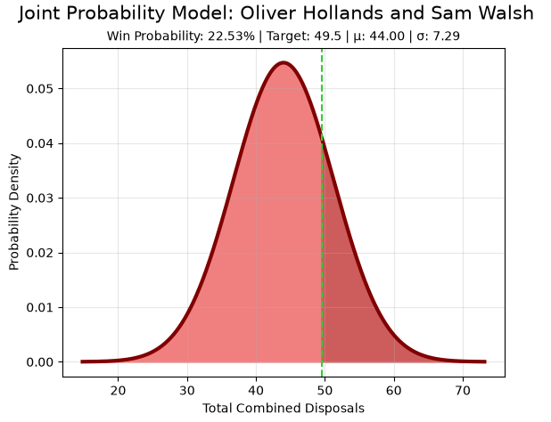
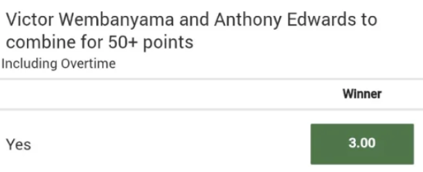

# Summary
This is a side project that presents a framework for pricing “Combined Total” player disposals markets (specifically in AFLM). 
By extracting implied probability parameters from player props from Pointsbet via TheOdds API , the model fits a joint Normal distribution to estimate the probability of two players reaching a certain disposal threshold. 
The system includes Monte Carlo simulations of wealth using Kelly staking to evaluate long term expectancy and risk adjusted returns of taking multiple bets in this market. 

# Background
I used to do EV betting, which would involve calculating the “true” odds of a bet and deciding whether it would benefit me in the long run. 
One of the markets these bets would include were combined totals, eg) “Player A and Player B to combine for X goals/points/disposals” which after asking another member, were found to be “impossible” to calculate (but approximated via rule of thumb). 

# Methodology
## Preprocessing and Devigging
The model scrapes real time data for upcoming matches via The Odds API, specifically Pointsbet (chosen arbitrarily). 

The API returns a JSON file which we then merge both “player_disposals” and “player_disposals_over” to create a probability map to each individual player. 

However, before you can fit a distribution, we note that we first have to remove the “vig” (vigorish) on the returned odds in order to get the “true” odds. 
Bookmakers bake [margins](https://www.aussportsbetting.com/guide/betting-agencies/bookmaker-margins/) into betting lines which is why punters lose money over the long run. 
A typical example would be a bookmaker pricing a coin flip at (1.91) instead of (2.00). The difference in the bookmaker odds and true odds is their profit margin. 

Standard devigging methods are under the assumption that bookmakers employ a linear margin across lines however it 
ignores the fact that higher risk premiums are applied to longshots as a result of [Favourite Longshot Bias](https://www.championbets.com.au/betting-academy-article/favourite-longshot-bias).
We assume that there must be some exponent factor which converts between bookmaker and true odds, implying that it would have the same effect on the true probability:

$$P_{fair} = (P_{implied})^k$$

To solve for this power, we refer back to a fixed anchor. We assume that the O/U line represents the exact middle $P_{o/u} = 0.5$. You can then solve for the exponent k via the O/U market odds ($Odds_{o/u}$):

$$ k = \dfrac{ln(0.5)}{ln(1/Odds_{o/u})} $$

## Parametric Calculations

We assume that the final count of disposals for each player follows a [Normal Distribution](https://en.wikipedia.org/wiki/Normal_distribution) $N(\mu\,\sigma\)$. Using the scraped data, we convert the disposals and their "true" implied probability into coordinates. 

1. $\mu\$ represents the player's O/U line 
2. $\sigma\$ is solved via [Least Square Optimisation](https://en.wikipedia.org/wiki/Least_squares) . This focuses on minimising the residual sum of squares between a theoretical Normal CDF and the devigged market data. :

 $$\min \sum_{i=1}^{n} (\Phi(x_i | \mu, \sigma) - P_{fair,i})^2$$

 However, on the off case where a player didn't have a O/U line or there wasn't enough data points, the standard deviation of a player's disposals would be calculated as a scalar multiple of the mean.
 To calculate this coefficient, we use the FitzRoy library and scrape data across the last three seasons. We then group by player name and use the built in R commands to calculate an average of ratios between a player's standard deviation of player disposals and their mean. 
 This comes out to about 0.3203 ( note that we filter players based on games played and if they are midfielder as those yield more accurate results). But to summarise, if there isn't enough data, we assume:

 $$\sigma\ = 0.3203 * \mu\$$ 

 

## Final Total Distribution

The sum of two R.Vs X and Y which are normally distributed, should also be normally distributed with parameters (see [Proof](https://en.wikipedia.org/wiki/Sum_of_normally_distributed_random_variables)):

  $$\mu_{total}\ = \mu_{X}\ +\mu_{Y}\$$  
  $$\sigma_{total} = \sqrt{\sigma_X^2 + \sigma_Y^2 + 2\rho\sigma_X\sigma_Y}$$
  
Player performances are correlated simply because they share the same ball. Once again, the FitzRoy library was used to scrape data from the last 3 seasons. Using built in R functions, we are able to calculate the correlation in disposals between two players which is further filtered by a minimum amount of games they are required to play together to reduce outliers.

This model would then output the probability of hitting 'X' disposals, which you can calculate the "true" odds by taking the reciprocal.

 

## Risk Simulation

The model gives the option to visualise sample wealths if you were to take EV / non EV bets via Monte Carlo simulations . Simulations bet according to a fractional [Kelly Criterion](https://help.bonusbank.com.au/article/386-what-is-the-kelly-criterion) which you are able to modify. This strategy maximises growth based on the amount of edge taken.  

$$f^* = FractionalKellyPortion \times \frac{(Odds \times P_{fair}) - 1}{Odds - 1}$$

Lastly, after running simulations, it outputs risk metrics like the Sharpe ratio and Max Drawdown based on the amount of simulations ran. 

## Motivation

On occasion, some bookmakers do offer combined totals:

 
 

So the point of this model should be to evaluate whether or not a certain promotional bet is worth being taken. (The example in README would be a -EV bet according to this model). Ideally, you would want to calculate the value of a bet right before the match happens as thats when the most money pours in and bookmakers have to adjust to crowd behaviour. 

Unfortunately, when I was betting on these markets, I didn't use this model and as such, I couldn't track the amount of EV I was taking. However, the rule of thumb for these types of bets is that if the target was close to the mean (which often it was) and the odds were far above 2, then it was usually EV. 

# Assumptions

Yeah, quite a few. 😬
* We assume that all players follow a Normal Distribution. While this might be a good fit for midfielders who have high volume in getting disposals, probably isn't as good for lower disposal players.
* Obviously, bookmaker margin should follow Favourite-Longshot bias but we're assuming that the vig applied on each line follows some fixed "stretch" factor k.
* We are only using 1 bookmaker for data scraping. Not all bookmakers will price the lines the exact same so the model would be a bit more "accurate" in averaging multiple bookmaker odds to reduce variance but not sure if the computation is worth it, especially if you're calculating multiple players in succession.

 

