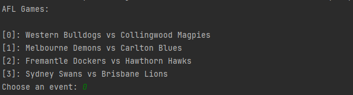
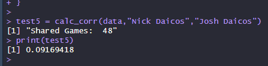
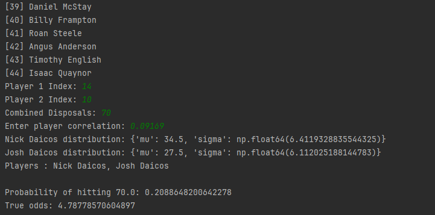
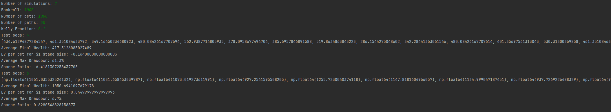

## About
Model that calculates the implied probability and true odds of player A and player B to combine for 'X' disposals (in AFLM), based off bookmaker odds.

  

  
## Features

| Feature                     | Description                                                                                  |
|-----------------------------|----------------------------------------------------------------------------------------------|
| **Devig Function**      | Power method devigging to remove favourite-longshot bias |
| **Individual Player Modelling**      | Uses bookmaker lines and least squares optimisation to fit individual player models |
| **Customisable Monte Carlo Risk Simulation**      | Includes modifiable parameters such as controlling Kelly portion and test odds |

## Example
This example uses this model to calculate the true odds and probability of the offer above (Nick and Josh Daicos to combine for 70+ disposals)

The model scrapes Pointsbet and returns upcoming AFL matches. You choose the indice corresponding to whatever game. 

You can use the [View Correlation Calculator](Correlation%20Calculator.R) to calculate the historical correlation between player A and player B 

Select player A and B via indices as well as a target total to hit. The model outputs their individual distributions as well as their joint distributions (assumed both to be Normal). 
The model also returns the fair odds and implied probability of the event occurring. 

You can also choose to run risk simulations with parameters based on the previous probabilities. Parameters include a starting bankroll, payout odds, number of bets, number of simulations and Kelly proportion. The model outputs the expected final wealth, EV per bet for $1 stake, Average max drawdown and the sharpe ratio.

